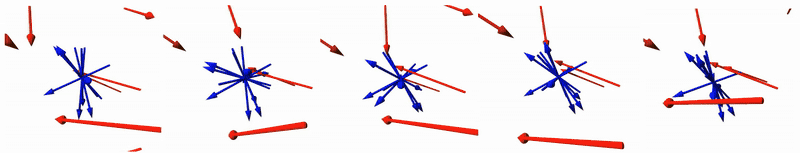

<div align="center">

# ScrewSplat: An End-to-End Method for <br> Articulated Object Recognition

### Conference on Robot Learning (CoRL) 2025

[Seungyeon Kim](https://seungyeon-k.github.io/)<sup>1</sup>,
Junsu Ha<sup>1</sup>,
Young Hun Kim<sup>1</sup>,
[Yonghyeon Lee](https://www.gabe-yhlee.com/)<sup>2</sup>, and 
[Frank C. Park](https://sites.google.com/robotics.snu.ac.kr/fcp/)<sup>1</sup>
<br>
<sup>1</sup>Seoul National University, <sup>2</sup>MIT, 

[Project Page](https://screwsplat.github.io/) | [Paper](https://arxiv.org/pdf/2508.02146v1)
<!-- | Paper | Video  -->

</div>

> TL;DR: This paper proposes a novel framework for recognizing and manipulating articulated objects.

## Preview
<I>ScrewSplat begins by randomly initializing 3D Gaussians and screw axes, which are then jointly optimized to recover the object’s part-wise 3D geometry and its underlying kinematic structure. </I>


## Requirements

### Environment
This project was developed in a standard Anaconda environment with CUDA 12.1. To install all dependencies, run the following commands:
```shell
conda create -n screwsplat python=3.10
conda activate screwsplat
conda install pytorch torchvision torchaudio pytorch-cuda=12.1 -c pytorch -c nvidia
pip install git+https://github.com/nerfstudio-project/gsplat.git
pip install -r requirements.txt
```

### (Optional) Download Articulated Object Assets and Blender
If you want to generate your own dataset that includes RGB images rendered from diverse articulated objects, you will need to download both the articulated object assets and the Blender program.

#### Download Articulated Object Assets
First, request access to the PartNet-Mobility dataset from [this link](https://sapien.ucsd.edu/), and place the extracted object folders into the ``datasets/partnet_mobility`` directory. The resulting structure should look like this:
```
datasets/
└── partnet_mobility/
    ├── 148/
    ├── 149/
    ├── ...
    ├── 104044/
    └── 104045/
```

#### Download and Extract Blender
Next, download the Blender 4.0.2 package from [here](https://download.blender.org/release/Blender4.0/blender-4.0.2-linux-x64.tar.xz), and extract it using the following command:
```shell
tar -xvf blender-4.0.2-linux-x64.tar.xz
```

## Dataset
### Articulated Object Visualization
Once you have downloaded the articulated object assets, you can visualize both the articulated object and the camera poses using the following script:
```shell
python visualize_object.py
```
To visualize a different articulated object, change joint configurations, or customize camera poses for generating your own dataset, edit the configuration file located at ``configs/vis_obj_config.yml``. 

### Generate Dataset
If you want to generate your own dataset, simply run the following script:
```shell
python generate_data.py
```
Make sure to adjust the settings in ``configs/gen_data_config.yml`` to specify the objects, camera extrinsic and intrinsic parameters, and dataset details, including the data generation mode (sequential or random). Also, ensure that the ``blender_root`` field in the configuration file points to the directory where the downloaded Blender package was extracted.

If you want to generate the dataset using the exact settings we used in our experiments, simply run the following script:
```shell
python generate_data.py --config configs/total/gen_single_data_config.yml
python generate_data.py --config configs/total/gen_multi_data_config.yml
```

### Download Dataset
If you prefer to use a pre-generated dataset instead of generating one yourself, simply download it from [this Google Drive link](https://drive.google.com/drive/folders/1yjLtU37KfjhHKS_v7pYqhffm9db_XZsZ?usp=sharing), and place the ``final`` folder into the ``datasets`` directory.

### Check Dataset Validity
Once you generate or download the dataset, make sure that the directory structure follows [this format](dataset_configuration.txt).

## Run
### Optimizing ScrewSplat
The ScrewSplat optimization code is ``train.py``. An example shell script for training on foldingchair is shown below:
```shell
python train.py -s datasets/final/foldingchair/102255/sequential_steps_5_full_48
```
To optimize ScrewSplat for other objects, simply replace the argument after ``-s`` with the dataset directory corresponding to the target object. For more examples, refer to the script at ``shell/test_all.sh``.

If you want to view intermediate training results in TensorBoard, run the following command:
```shell
tensorboard --logdir output/ --samples_per_plugin images=100
```
The argument ``--samples_per_plugin images=100`` allows for better visualization of the articulated object's motion in TensorBoard. If you're running this on a remote server, be sure to add ``--host {ip_address}`` to the command. 

Additionally, if you'd like to train Gaussian Splatting on a single articulation (i.e., a static articulated object), refer to the following example shell script:
```shell
python train_gs.py -s datasets/final/foldingchair/102255/sequential_steps_5_full_48/0
```

### Download Pretrained ScrewSplat
If you prefer to use a pre-generated dataset instead of generatin one yourself, simply download it from [this Google Drive link](https://drive.google.com/drive/folders/1ClplSaVC_Hk12W_zjJz8sWOQwTmOp2Nz?usp=sharing), and place the ``pretrained`` folder into the ``output`` directory.

### Articulated Object Manipulation

#### Text-guided Articulated Object Joint Angle Control 
The text-guided articulated object manipulation code is in ``text_guided_manipulation.py``. An example shell script for manipulating the foldingchair is shown below:
```shell
python text_guided_manipulation.py --object_class foldingchair
```
The above command only works if you downloaded the pretrained ScrewSplat model as described earlier. If you want to use your own optimized ScrewSplat model or specify a custom model path, refer to the script below:
```shell
python text_guided_manipulation.py --model_path output/pretrained/foldingchair/102255/sequential_steps_5_full_48_0.002/71a091eb-7
```
Currently, the input text description and target text prompt must be modified directly within the code.

#### (Experimental Code) Overall Real-world Articulated Object Manipulation
The overall real-world articulated object recognition and manipulation logic is implemented in ``control/__init__.py``. This code is intended for communication with a real-world robot and cannot run independently, but it is provided as a reference to show how the full manipulation pipeline was structured. The system uses LangSAM for object segmentation, which can be installed using the following script:
```shell
pip install -U git+https://github.com/luca-medeiros/lang-segment-anything.git@05c386ee95b26a8ec8398bebddf70ffb8ddd3faf
```
Note: The LangSAM import in ``control/__init__.py`` is currently commented out -- be sure to uncomment it if you plan to run the code.

In our setup, we simply executed the following script to perform manipulation:
```shell
python control.py
```
For more details, refer to the ``control/__init__.py`` file and the configuration file at ``control/control.yml``.

## Acknowledgement
### Dataset generation
- PartNet-Mobility objects can be obtained from the official [SAPIEN](https://sapien.ucsd.edu/) website.

### ScrewSplat
- The 3D Gaussian model construction is based on the original [gaussian-splatting](https://github.com/graphdeco-inria/gaussian-splatting) code, with additional references from the [drrobot](https://github.com/cvlab-columbia/drrobot) implementation, which utilizes [gsplat](https://github.com/nerfstudio-project/gsplat).

### Text-guided manipulation
- [Language Segment-Anything](https://github.com/luca-medeiros/lang-segment-anything) is used as the segmentation model.

## Citation
If you found this repository useful in your research, please consider citing:
```
@article{kim2025screwsplat,
  title={ScrewSplat: An End-to-End Method for Articulated Object Recognition},
  author={Kim, Seungyeon and Ha, Junsu and Kim, Young Hun and Lee, Yonghyeon and Park, Frank C},
  journal={arXiv preprint arXiv:2508.02146},
  year={2025}
}
```